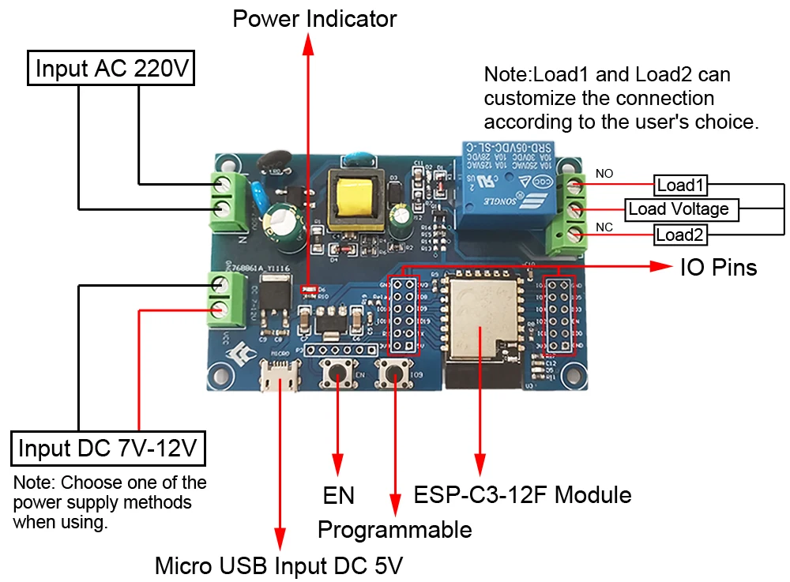
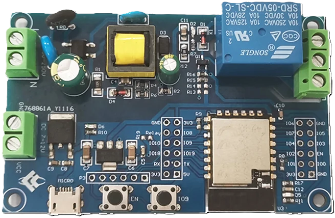
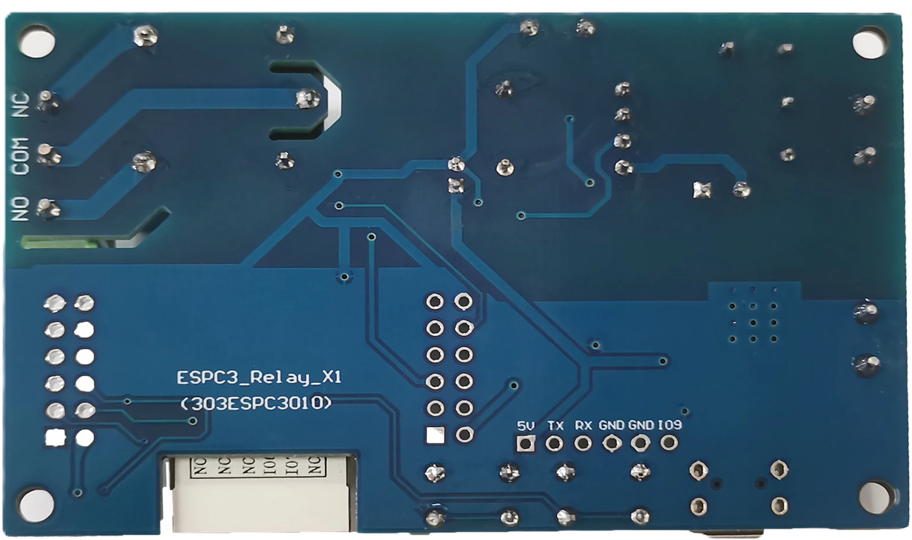
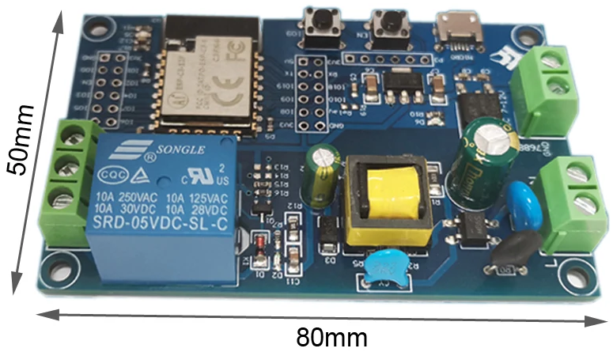

# Crono, Smart Thermostat based on ESPC3_Relay_X1 board

### Front View

### Rear View

### Size

|            |        |
|------------|--------|
| __Length__ | 80mm   |
| __Width__  | 50mm   |
| __Height__ | 20mm   |

## Description
The AC / DC power supply esp32-c3 single circuit relay development board is equipped with esp-c3-12f old three
WiFi &amp; ble module, 1 / O port fully led out, supports AC90-250V power supply or dc7-12v power supply
Suitable for esp32-c3 secondary development and learning, smart home wireless control and other occasions.
Functional features
1. Onboard mature and stable esp-c3-12f module with large capacity of 4m byte flash;
2. The I/O port and UART program download port of esp32-c3 module are all led out to facilitate secondary development
3. On board AC-DC and DC-DC switching power supply modules, the power supply mode supports AC90-250V/dc7-12v;
4. En power button and io9 programmable key of onboard esp32-c3 module;
5. Esp32-c3 supports the use of Arduino ide development tools and provides reference programs under the Arduino development environment
6. On board 1-way 5V relay, output switch signal, suitable for controlling the load with working voltage within AC250V / dc3ov;
7. On board power indicator, 1 programmable led and relay indicator

Writing port: 

GND, Rx, TX and 5V of esp32-c3 are respectively connected to GND of external TTL serial port module
TX, Rx, 5V, io9 needs to be connected to GND when downloading, and then disconnect the connection between io9 and GND after downloading.

Relay output:

* NC: normally closed end, short circuited with com before the relay is pulled in, and suspended after it is pulled in
* COM: public end.
* NO: normally open, the relay is suspended before closing, and is short circuited with com after closing.