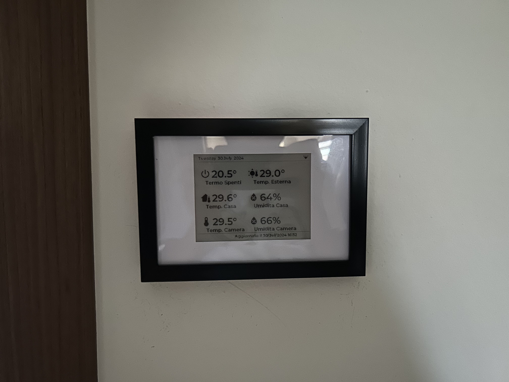

# Crono, Smart Thermostat based on E-Paper ESP32 Driver Board

|            |          |
|------------|--------- |
| __Length__ | 48.25mm  |
| __Width__  | 29.46mm  |

[e-paper-esp32-driver-board](https://www.waveshare.com/e-paper-esp32-driver-board.htm)

[E-Paper_ESP32_Driver_Board Wiki](https://www.waveshare.com/wiki/E-Paper_ESP32_Driver_Board)

[Amazon link](https://www.amazon.it/gp/product/B0BRV8M6HB/ref=ppx_yo_dt_b_search_asin_title?ie=UTF8&psc=1)
## Description
This project creates a thermostat used to control the heating system of my house in addition with an e-paper display that is used to show usefull information like house temperature/humidity and if the heating system is working or not.

The e-Paper ESP32 Driver Board is a wireless solution for refreshing e-Paper display content, suitable for applications such as: supermarket price tag, e-Card, serial port info monitoring, etc.

## First Installation

To install the very first esphome firmware we need to connect the board to an usb cable and then we can use the [ESPHome Web](https://web.esphome.io/?dashboard_wizard) to prepare the device for first use or install the custom firmware we prepared.

## PIN Configuration

As described by the image above the ESP32 is connected with the e-paper display and with the relay that will be used to control the heating system.

## Final result
Below you have the final result of this project a 4inch e-paper display that is attached to a frame and connected to the e-Paper ESP32 Driver Board.

