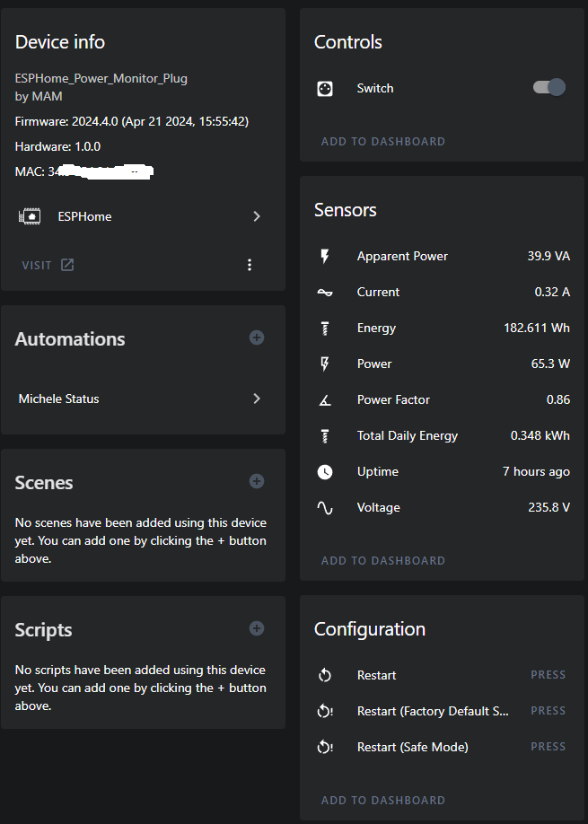

# ESPHome Refoss P11

[Here](https://devices.esphome.io/devices/refoss-p11-plug)
 you can find the standard configuration from devices.esphome.io

## GPIO configuration

| Pin	| Function      | Inverted |
|-------|-------------|-----------|
|GPIO03 | CSE7766 Rx  |           |
|GPIO04	| LedLinki    | TRUE      |
|GPIO05	| Button 1    |           |
|GPIO12	| Led_i 1     | TRUE      |
|GPIO13	| Relay 1     |           |
|GPIO17	| ADC Temp    |           |

> [!IMPORTANT]
> This device comes with Tasmota already installed!

We need to migrate this device from Tasmota to ESPHome. 
The [Migrating from Tasmota](https://esphome.io/guides/migrate_sonoff_tasmota.html) page explains how to do, it is very simple. After the migration is done it is possible to configure the device in HA.

# References
[DzurisHome ESPHome Refoss P11](https://github.com/DzurisHome/ESPHome-Refoss-P11/)

[ESPHome Device](https://devices.esphome.io/devices/refoss-p11-plug)